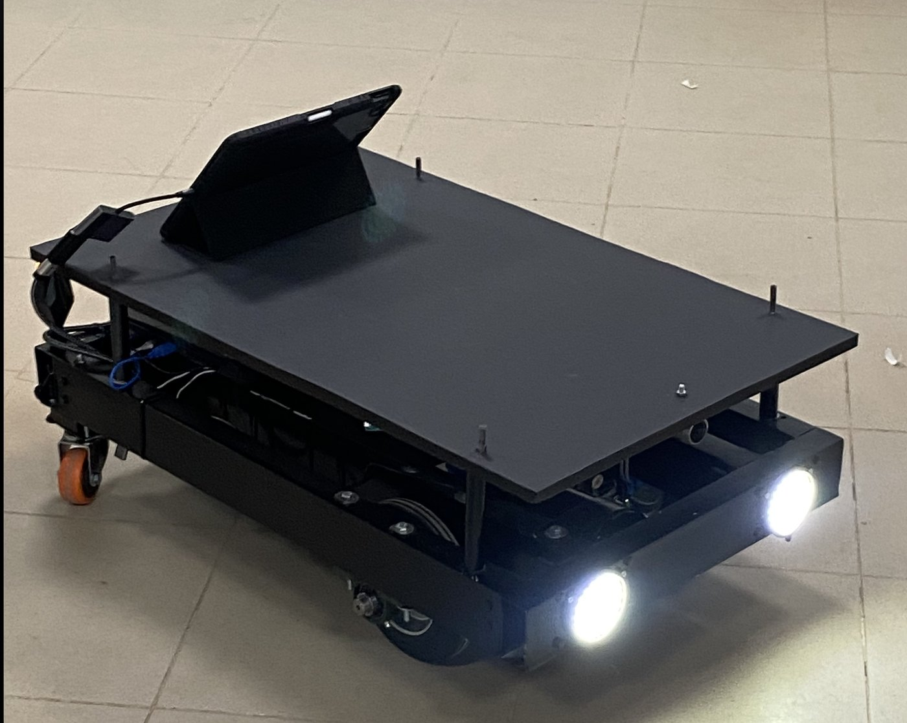
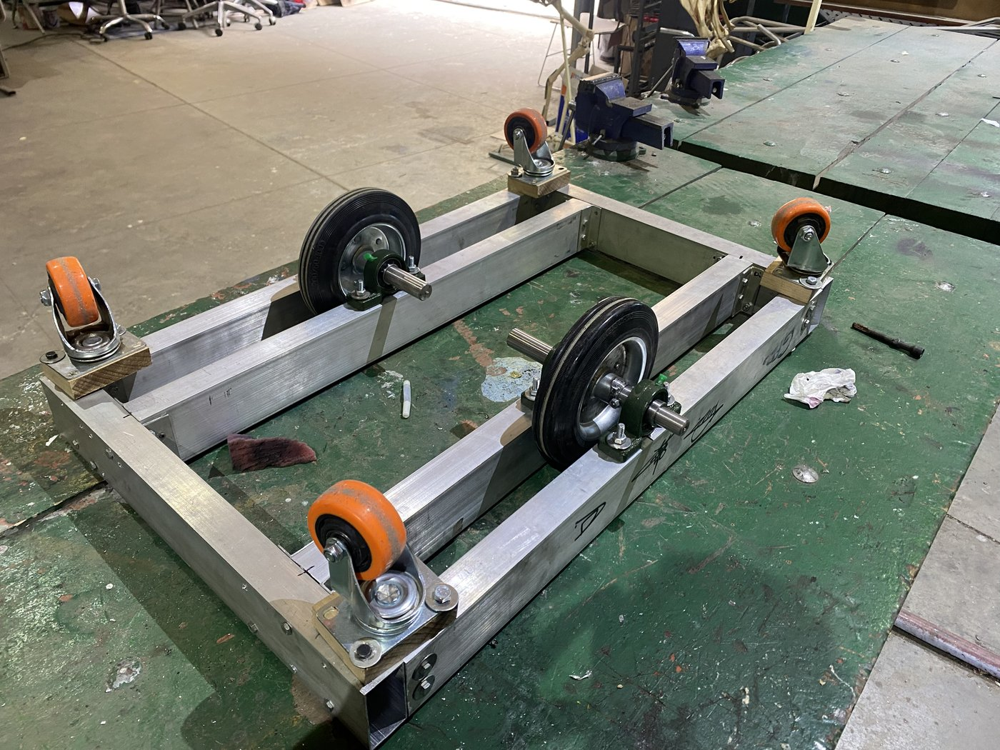
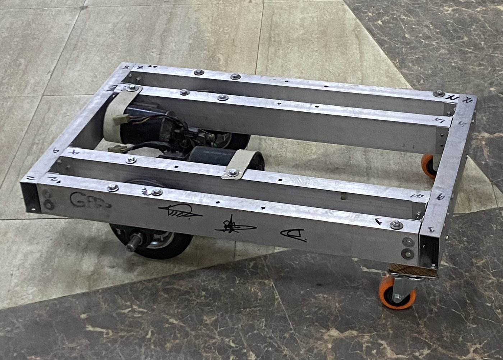
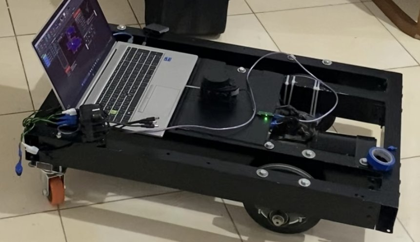
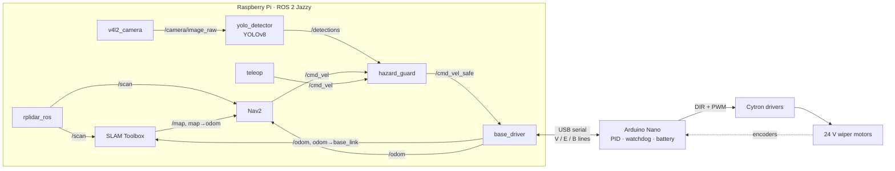

# Autonomous Mobile Robot (ROS 2)

A differential-drive indoor robot I built end to end: an 80 × 45 cm aluminium chassis I fabricated myself, 24 V wiper-motor drivetrain, Arduino motor controller, Raspberry Pi running ROS 2 Jazzy, a 360° LiDAR for SLAM and navigation, and an on-device YOLOv8 detector that stops the robot before it drives towards stairs or drop-offs.

<p align="center">
  
</p>


## What it does

- **Maps** an unknown indoor space live with SLAM Toolbox from the 360° LiDAR scan and wheel odometry.
- **Navigates** to goals and patrols waypoints with Nav2 (MPPI controller, rectangular footprint, costmaps from the LiDAR).
- **Detects stairs and hazards** on the Raspberry Pi with YOLOv8. A safety gate between Nav2 and the motors blocks forward motion while a hazard is close, but still allows turning and reversing away.
- **Controls the wheels in closed loop** on an Arduino Nano: per-wheel velocity PID from encoders, a command watchdog and a low-battery cutoff.
- **Runs in simulation** with the same robot geometry in Gazebo, so the whole stack can be developed and tested on a laptop.

## Build

| Fabricating the frame | Drivetrain installed | First LiDAR bring-up |
|---|---|---|
|  |  |  |

| Part | Choice |
|---|---|
| Chassis | 80 × 45 cm aluminium rectangular tube, cut, drilled and bolted by hand; top deck on standoffs |
| Drivetrain | 2 × 24 V car wiper motors with added encoders, 15 cm wheels on a centre axle (30 cm track), 4 swivel casters at the corners |
| Motor drivers | Cytron DIR/PWM DC motor drivers |
| Motor controller | Arduino Nano |
| Main computer | Raspberry Pi running Ubuntu 24.04 and ROS 2 Jazzy |
| LiDAR | RPLidar A1, 360°, mounted in the exact centre of the robot |
| Camera | Forward-facing USB camera, tilted down, for hazard detection |
| Power | 24 V Li-ion pack, voltage monitored by the Arduino |

The drive wheels sit on the centre axle, so the robot turns on the spot about its own centre. That keeps the 80 cm body predictable in tight spaces and makes the LiDAR's centre the robot's rotation axis.

## Architecture



Every velocity command, from Nav2 or a human with a keyboard, passes through `hazard_guard` before it reaches the wheels.

## Repository layout

```
firmware/                 Arduino Nano motor controller (PlatformIO)
ros2_ws/src/
  amr_base/               Serial driver: cmd_vel → wheel speeds, encoder ticks → odometry + TF, battery
  amr_perception/         YOLOv8 detector, hazard guard, training script for the stairs model
  amr_description/        URDF of the robot (frame, wheels, casters, LiDAR, camera)
  amr_bringup/            Launch files and Nav2 / SLAM config for the real robot
  amr_sim/                Gazebo world with the same robot, SLAM and Nav2 launch files, patrol script
raspberry_pi/             One-shot Pi setup, udev rules, systemd service
docker/                   ROS 2 desktop in the browser for development on any laptop
```

## Try it in simulation

You need Docker. This gives you a full ROS 2 desktop with Gazebo and RViz in the browser.

```bash
docker compose -f docker/compose.yaml up -d --build
```

Open http://localhost:6080, start a terminal on that desktop, and run:

```bash
cd ~/ros2_ws && colcon build --symlink-install && source install/setup.bash
ros2 launch amr_sim slam.launch.py     # drive with the keyboard window, watch the map build
ros2 launch amr_sim nav.launch.py      # mapping + Nav2: set goals in RViz
ros2 run amr_sim patrol.py --loop      # in a second terminal, with nav.launch.py running
```

## Run it on the robot

1. **Flash the Arduino:** see [`firmware/README.md`](firmware/README.md) for wiring, calibration and the serial protocol.
2. **Set up the Pi** (Ubuntu Server 24.04, 64-bit):
   ```bash
   git clone https://github.com/Eslamhabashy1/autonomous-mobile-robot.git ~/amr
   cd ~/amr/raspberry_pi && ./setup.sh
   ```
   This installs ROS 2 Jazzy and the dependencies, adds udev rules so the LiDAR and the Arduino always appear as `/dev/rplidar` and `/dev/amr_base`, builds the workspace, and enables a systemd service.
3. **Map, then navigate:**
   ```bash
   ros2 launch amr_bringup slam.launch.py                 # drive around with teleop to build a map
   ros2 run nav2_map_server map_saver_cli -f ~/maps/home   # save it
   ros2 launch amr_bringup nav.launch.py                  # SLAM + Nav2
   ```
4. **Watch from a laptop** on the same network and `ROS_DOMAIN_ID`: `ros2 launch amr_bringup rviz.launch.py`

To run without the camera and detector: `ros2 launch amr_bringup robot.launch.py use_perception:=false`.

## Hazard detection

`yolo_detector` runs Ultralytics YOLOv8n on the camera feed. It always processes the newest frame and drops older ones, so a slow Pi adds no lag. `hazard_guard` counts a detection as dangerous when:

- its class is in `hazard_classes` (`stairs`, `drop`),
- its confidence is at least `min_score`, and
- the bottom of its box is in the lower part of the image. With the camera tilted down, that means the hazard is close.

While a hazard is active, and for `hold_time` seconds after the last sighting, forward velocity is set to zero. Turning and reversing still pass through, so Nav2 can back out and replan.

The stock COCO weights have no stairs class, so the detector uses a fine-tuned model. [`training/train_hazards.py`](ros2_ws/src/amr_perception/training/train_hazards.py) fine-tunes YOLOv8n on a stairs / drop-off dataset and exports it to NCNN, which runs much faster than PyTorch on the Pi's ARM CPU.

## Testing

```bash
cd ros2_ws && colcon build && colcon test && colcon test-result --verbose
```

- **Unit tests** cover the serial protocol parser, the diff-drive kinematics, odometry integration (straight line, spin in place, a 90° arc, MCU reset) and the hazard decision logic. None of these need hardware.
- **Firmware** builds with `pio run` for the Arduino Nano.
- **End-to-end:** the driver and the hazard guard have been exercised against a simulated Arduino on a virtual serial port. The robot drives, stops when a stairs detection appears, and resumes when it clears.

## License

[MIT](LICENSE)
